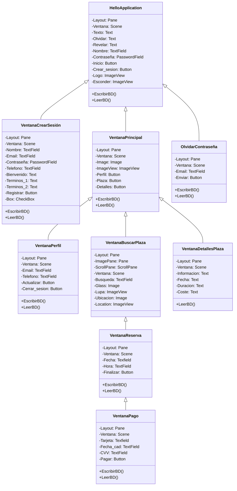

```mermaid
classDiagram
HelloApplication <|--VentanaCrearSesión
HelloApplication <|--VentanaPrincipal
HelloApplication <|--OlvidarContraseña

VentanaPrincipal <|--VentanaPerfil
VentanaPrincipal <|--VentanaBuscarPlaza
VentanaPrincipal <|--VentanaDetallesPlaza

VentanaBuscarPlaza <|--VentanaReserva

VentanaReserva <|--VentanaPago

class HelloApplication{
	-Layout: Pane
  -Ventana: Scene
	-Texto: Text
  -Olvidar: Text
  -Revelar: Text
  -Nombre: TextField
  -Contraseña: PasswordField
  -Inicio: Button
  -Crear_sesion: Button
  -Logo: ImageView
  -Esconder: ImageView
  +EscribirBD()
  +LeerBD()
}

class VentanaCrearSesión{
  -Layout: Pane
  -Ventana: Scene
  -Nombre: TextField
  -Email: TextField
  -Contraseña: PasswordField
  -Telefono: TextField
  -Bienvenido: Text
  -Terminos_1: Text
  -Terminos_2: Text
  -Registrar: Button
  -Box: CheckBox
  +EscribirBD()
  +LeerBD()
}

class VentanaPrincipal{
  -Layout: Pane
  -Ventana: Scene
  -Image: Image
  -ImageView: ImageView
  -Perfil: Button
  -Plaza: Button
  -Detalles: Button
  +EscribirBD()
  +LeerBD()
}

class OlvidarContraseña{
  -Layout: Pane
  -Ventana: Scene
  -Email: TextField
  -Enviar: Button
  +EscribirBD()
  +LeerBD()
}

class VentanaPerfil{
  -Layout: Pane
  -Ventana: Scene
  -Email: TextField
  -Telefono: TextField
  -Actualizar: Button
  -Cerrar_sesion: Button
  +EscribirBD()
  +LeerBD()
}

class VentanaBuscarPlaza{
  -Layout: Pane
  -ImagePane: Pane
  -ScrollPane: ScrollPane
  -Ventana: Scene
  -Busqueda: TextField
  -Glass: Image
  -Lupa: ImageView
  -Ubicacion: Image
  -Location: ImageView
}

class VentanaDetallesPlaza{
  -Layout: Pane
  -Ventana: Scene
  -Informacion: Text
  -Fecha: Text
  -Duracion: Text
  -Coste: Text
  +LeerBD()
}

class VentanaReserva{
  -Layout: Pane
  -Ventana: Scene
  -Fecha: Texfield
  -Hora: TextField
  -Finalizar: Button
  +EscribirBD()
  +LeerBD()
}

class VentanaPago{
  -Layout: Pane
  -Ventana: Scene
  -Tarjeta: Texfield
  -Fecha_cad: TextField
  -CVV: TextField
  -Pagar: Button
  +EscribirBD()
  +LeerBD()
}
```
